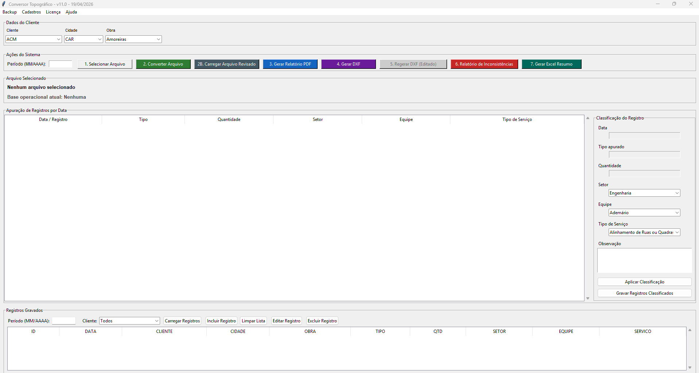

# 📐 Conversor Topográfico

Sistema desktop desenvolvido em **Python** para conversão, tratamento e análise de dados topográficos, com geração de arquivos técnicos e relatórios completos.

---

## 🖥️ Interface do Sistema

---

## 🚀 Visão Geral

O **Conversor Topográfico** automatiza o processamento de dados topográficos, transformando arquivos brutos em saídas estruturadas prontas para uso técnico.

Desenvolvido com foco em:

- ✔️ Produtividade  
- ✔️ Confiabilidade  
- ✔️ Automação  
- ✔️ Organização de dados  

---

## ⚙️ Funcionalidades

### 📂 Importação de Dados
- Leitura de arquivos estruturados
- Tratamento automático de inconsistências
- Normalização de dados

### 🔄 Conversão Topográfica
- Processamento inteligente
- Padronização de informações
- Estruturação técnica dos dados

### 📐 Geração de Arquivos

- 📄 Relatórios em PDF  
- 📊 Exportação para Excel  
- 📁 Arquivos DXF (AutoCAD)  

### 🧠 Validação e Consistência
- Identificação de erros
- Relatório de inconsistências
- Feedback claro para o usuário

### 💾 Persistência de Dados
- Banco de dados integrado
- Histórico de registros
- Organização por cliente/obra

### 🔄 Backup
- Sistema de backup integrado
- Segurança dos dados

### 🔐 Licenciamento
- Validação por ID da máquina
- Controle de uso do sistema

### 🔄 Atualizações
- Verificação automática via GitHub
- Atualizador integrado

---

## ▶️ Fluxo de Uso

1. Selecionar arquivo  
2. Converter dados  
3. Revisar (opcional)  
4. Gerar saídas:
   - PDF  
   - DXF  
   - Excel  
5. Analisar inconsistências  
6. Salvar registros  

---

## 🧱 Arquitetura

---

## 🛠️ Tecnologias

- Python 3  
- Tkinter  
- Matplotlib  
- SQLite  
- PyInstaller  
- EXDXF  
- OpenPyXL  

---

